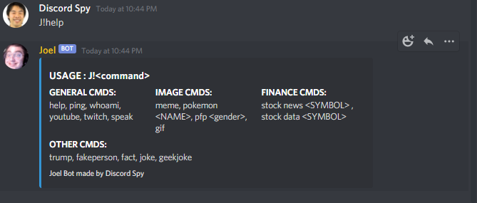

# Joel Discord Bot

<h1>Setup: </h1>

<h3>Heroku (via git): </h3>
<pre>
git add -A
git commit -m "your awesome commit"
git push heroku GIT_BRANCH
</pre>

<h3>Docker </h3>
<pre>
sudo docker build -t NAME .
sudo docker run NAME
</pre>

<h1>Commands: </h1>
